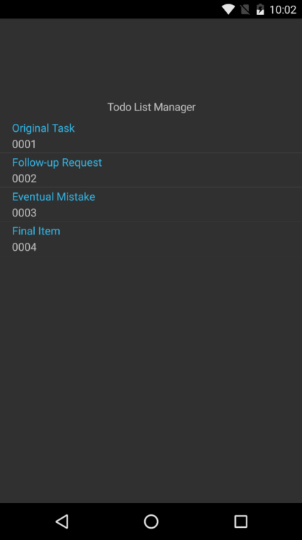

# **Solution:** Implement a Data-Tier Using C# Classes



## Project Files

### Data/ITodoContext.cs

First, we implement an interface for all of our context classes.

```c#
using System.Collections.Generic;

namespace MobileBootcamp.Data
{
    public interface ITodoContext
    {
        IEnumerable<TodoItem> GetItems();

        void AddItem(TodoItem item);
    }
}
```

### Data/TodoInMemoryContext.cs

Next, we create a simple data context for our todo items in-memory. The implementation is largely up to you.

```c#
using System;
using System.Collections.Generic;

namespace MobileBootcamp.Data
{
    public class TodoInMemoryContext : ITodoContext
    {
        private List<TodoItem> todoItems = new List<TodoItem>
        {
            new TodoItem { Id = "0001", Text = "Original Task" },
            new TodoItem { Id = "0002", Text = "Follow-up Request" },
            new TodoItem { Id = "0003", Text = "Eventual Mistake" },
            new TodoItem { Id = "0004", Text = "Final Item" }
        };

        public void AddItem(TodoItem item)
        {
            item.Id = Guid.NewGuid().ToString();
            todoItems.Add(item);
        }

        public IEnumerable<TodoItem> GetItems()
        {
            return todoItems;
        }
    }
}
```

### HomePage.cs

Finally, we implement this data-tier in our *HomePage* class. We create a private instance of our context and then use it in our class.

```c#
this.Content = new StackLayout
{
    VerticalOptions = LayoutOptions.Center,
    Children =
    {
        new Label
        {
            HorizontalTextAlignment = TextAlignment.Center,
            Text = "Todo List Manager"
        },
        new ListView
        {
            ItemsSource = this._context.GetItems(),
            ItemTemplate = todoTemplate
        }
    }
};
```

## Visual Studio Solution

[You can always view the entire Visual Studio solution](solution/).
