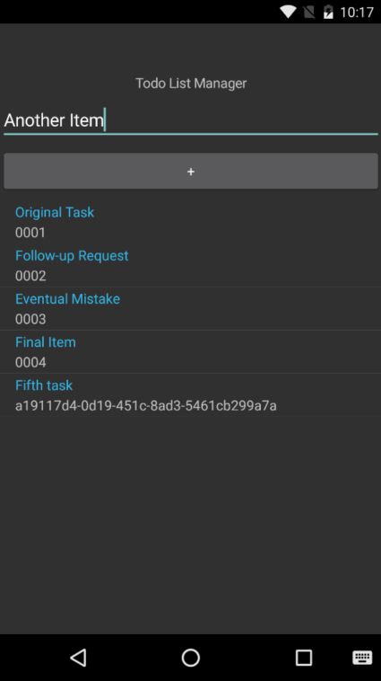

# **Solution:** Create an Input Form Using The Entry Class



## Project Files

### HomePage.cs

Things are starting to get very interesting. A couple of things have happened here:
  - We created a new private instance of **ObservableCollection<TodoItem>** in the class
  - There are two more variables for an **Entry** and a **Button**
  - An event handler has been added to the Button that adds a new item to both the *ObservableCollection<>* and the *context*
  - The controls were added to the *StackLayout*

```c#
using MobileBootcamp.Data;
using System;
using System.Collections.ObjectModel;
using Xamarin.Forms;

namespace MobileBootcamp
{
    public class HomePage : ContentPage
    {
        private ITodoContext _context = new TodoInMemoryContext();
        private ObservableCollection<TodoItem> _todoItemsCollection;

        public HomePage()
        {
            BuildContent();
        }

        Entry textBox = new Entry();
        Button textButton = new Button { Text = "+" };

        private void BuildContent()
        {
            DataTemplate todoTemplate = new DataTemplate(typeof(TextCell));
            todoTemplate.SetBinding(TextCell.TextProperty, "Text");
            todoTemplate.SetBinding(TextCell.DetailProperty, "Id");

            textButton.Clicked += OnClick;

            _todoItemsCollection = new ObservableCollection<TodoItem>(this._context.GetItems());

            this.Content = new StackLayout
            {
                VerticalOptions = LayoutOptions.Center,
                Children =
                {
                    new Label
                    {
                        HorizontalTextAlignment = TextAlignment.Center,
                        Text = "Todo List Manager"
                    },
                    textBox,
                    textButton,
                    new ListView
                    {
                        ItemsSource = _todoItemsCollection,
                        ItemTemplate = todoTemplate
                    }
                }
            };
        }

        private void OnClick(object sender, EventArgs e)
        {
            var newItem = new TodoItem
            {
                Text = textBox.Text
            };

            textBox.Text = String.Empty;

            this._context.AddItem(newItem);
            _todoItemsCollection.Add(newItem);

            DisplayAlert("New Item", "Your todo item has been added successfully", "OK");
        }
    }
}
```

## Visual Studio Solution

[You can always view the entire Visual Studio solution](solution/).
