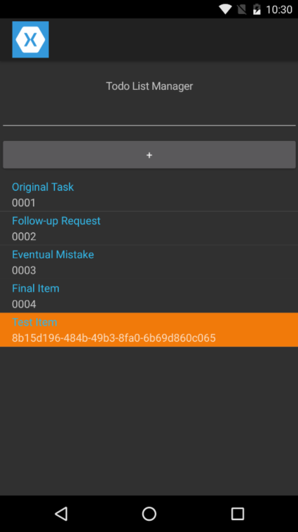

# **Solution:** Implement Navigation and a Second Page

| HomePage | DetailsPage |
| --- | --- |
|  |  |

## Project Files

### DetailsPage.cs

Let's start with the DetailsPage. It's a very simple implementation that takes in a *TodoItem* instance through it's constructor.

```c#
using MobileBootcamp.Data;
using Xamarin.Forms;

namespace MobileBootcamp
{
    public class DetailsPage : ContentPage
    {
        public DetailsPage(TodoItem item)
        {
            BuildContent(item);
        }

        private void BuildContent(TodoItem item)
        {
            this.BindingContext = item;

            this.Content = new StackLayout
            {
                Children =
                {
                    new Label { Text = item.Id, FontSize = 30, FontAttributes = FontAttributes.Bold },
                    new Label { Text = item.Text }
                }
            };
        }
    }
}
```

### HomePage.cs

At this point, I have taken all of the UI elements and I create them much earlier in the class file. I then just pass in the variables as Children of the StackLayout. This makes it a lot easier to keep adding things like event handlers.

```c#
using MobileBootcamp.Data;
using System;
using System.Collections.ObjectModel;
using Xamarin.Forms;

namespace MobileBootcamp
{
    public class HomePage : ContentPage
    {
        private ITodoContext _context = new TodoInMemoryContext();
        private ObservableCollection<TodoItem> _todoItemsCollection;

        public Label titleLabel = new Label();
        public ListView listView = new ListView();
        public Entry textBox = new Entry();
        public Button textButton = new Button();

        public HomePage()
        {
            BuildContent();
        }

        private void BuildContent()
        {
            DataTemplate todoTemplate = new DataTemplate(typeof(TextCell));
            todoTemplate.SetBinding(TextCell.TextProperty, "Text");
            todoTemplate.SetBinding(TextCell.DetailProperty, "Id");

            textButton.Text = "+";
            textButton.Clicked += OnClick;

            _todoItemsCollection = new ObservableCollection<TodoItem>(this._context.GetItems());

            listView.ItemsSource = _todoItemsCollection;
            listView.ItemTemplate = todoTemplate;
            listView.ItemSelected += OnSelection;

            titleLabel.HorizontalTextAlignment = TextAlignment.Center;
            titleLabel.Text = "Todo List Manager";

            this.Content = new StackLayout
            {
                VerticalOptions = LayoutOptions.Center,
                Children =
                {
                    titleLabel,
                    textBox,
                    textButton,
                    listView
                }
            };
        }

        private void OnClick(object sender, EventArgs e)
        {
            var newItem = new TodoItem
            {
                Text = textBox.Text
            };

            textBox.Text = String.Empty;

            this._context.AddItem(newItem);
            _todoItemsCollection.Add(newItem);

            DisplayAlert("New Item", "Your todo item has been added successfully", "OK");
        }

        private async void OnSelection(object sender, SelectedItemChangedEventArgs e)
        {
            if (e.SelectedItem != null && e.SelectedItem is TodoItem)
            {
                await Navigation.PushAsync(new DetailsPage(e.SelectedItem as TodoItem));
            }
        }
    }
}
```

### App.cs

This is the simplest change of all, we only need to wrap the **HomePage** instance in a **NavigationPage** instance.

```c#
using Xamarin.Forms;

namespace MobileBootcamp
{
    public class App : Application
    {
        public App()
        {
            this.MainPage = new NavigationPage(new HomePage());
        }
    }
}
```

## Visual Studio Solution

[You can always view the entire Visual Studio solution](solution/).
