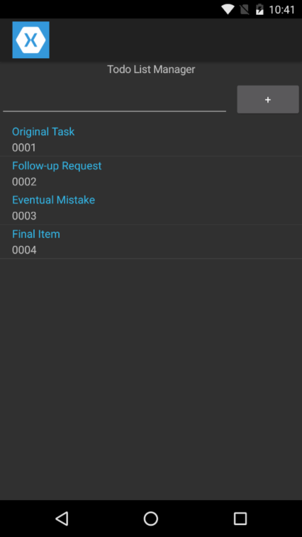

# **Solution:** Re-design User Interfaces Using XAML

| HomePage | DetailsPage |
| --- | --- |
|  |  |

## Project Files

> Remember, this is only an example implementation. You are free to complete this however you like.

### HomeView.xaml

We can separate a lot of UI and layout logic and place that directly in the XAML file.

```xaml
<?xml version="1.0" encoding="utf-8" ?>
<ContentPage xmlns="http://xamarin.com/schemas/2014/forms"
             xmlns:x="http://schemas.microsoft.com/winfx/2009/xaml"
             x:Class="MobileBootcamp.HomeView">
  <StackLayout VerticalOptions="Start">
    <Label HorizontalTextAlignment="Center" Text="Todo List Manager" />
    <Grid>
      <Grid.ColumnDefinitions>
        <ColumnDefinition Width="*" />
        <ColumnDefinition Width="Auto" />
      </Grid.ColumnDefinitions>
      <Entry x:Name="TextData" Grid.Column="0" />
      <Button Grid.Column="1" Text="+" Clicked="OnClick" />
    </Grid>
    <ListView x:Name="ListData" ItemSelected="OnSelection">
      <ListView.ItemTemplate>
        <DataTemplate>
          <TextCell Text="{Binding Text}" Detail="{Binding Id}" />
        </DataTemplate>
      </ListView.ItemTemplate>
    </ListView>
  </StackLayout>
</ContentPage>
```

#### HomeView.xaml.cs

This leaves us with a *much* smaller C# file and we still were able to re-use most of our code.

```C#
using MobileBootcamp.Data;
using System;
using System.Collections.ObjectModel;
using Xamarin.Forms;

namespace MobileBootcamp
{
    public partial class HomeView : ContentPage
    {
        private ITodoContext _context = new TodoInMemoryContext();
        private ObservableCollection<TodoItem> _todoItemsCollection;

        public HomeView()
        {
            InitializeComponent();

            LoadListData();
        }

        private void LoadListData()
        {
            _todoItemsCollection = new ObservableCollection<TodoItem>(this._context.GetItems());
            this.ListData.ItemsSource = _todoItemsCollection;
        }

        private void OnClick(object sender, EventArgs e)
        {
            var newItem = new TodoItem
            {
                Text = this.TextData.Text
            };

            this.TextData.Text = String.Empty;

            this._context.AddItem(newItem);
            _todoItemsCollection.Add(newItem);

            DisplayAlert("New Item", "Your todo item has been added successfully", "OK");
        }

        private async void OnSelection(object sender, SelectedItemChangedEventArgs e)
        {
            if (e.SelectedItem != null)
            {
                await Navigation.PushAsync(new DetailsView { BindingContext = e.SelectedItem });
            }
        }
    }
}
```

### DetailsView.xaml

Again, you can accomplish most of the UI logic directly in XAML.

```xaml
<?xml version="1.0" encoding="utf-8" ?>
<ContentPage xmlns="http://xamarin.com/schemas/2014/forms"
             xmlns:x="http://schemas.microsoft.com/winfx/2009/xaml"
             x:Class="MobileBootcamp.DetailsView">
  <StackLayout VerticalOptions="Center">
    <Label Text="{Binding Id}" FontAttributes="Bold" HorizontalTextAlignment="End" FontSize="30" />
    <Label Text="{Binding Text}" HorizontalTextAlignment="Center" LineBreakMode="WordWrap" />
  </StackLayout>
</ContentPage>
```

#### DetailsView.xaml.cs

We did not need to make any changes to the default class that was generated.

```C#
using Xamarin.Forms;

namespace MobileBootcamp
{
    public partial class DetailsView : ContentPage
    {
        public DetailsView()
        {
            InitializeComponent();
        }
    }
}
```

### App.cs

Simply switch out **HomePage** for **HomeView** in the *App* class.

```C#
using Xamarin.Forms;

namespace MobileBootcamp
{
    public class App : Application
    {
        public App()
        {
            this.MainPage = new NavigationPage(new HomeView());
        }
    }
}
```

## Visual Studio Solution

[You can always view the entire Visual Studio solution](solution/).
