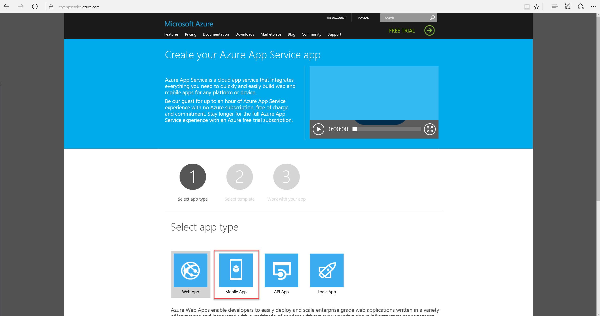
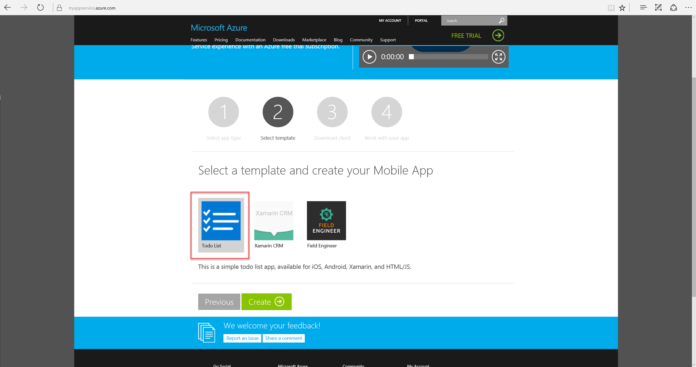
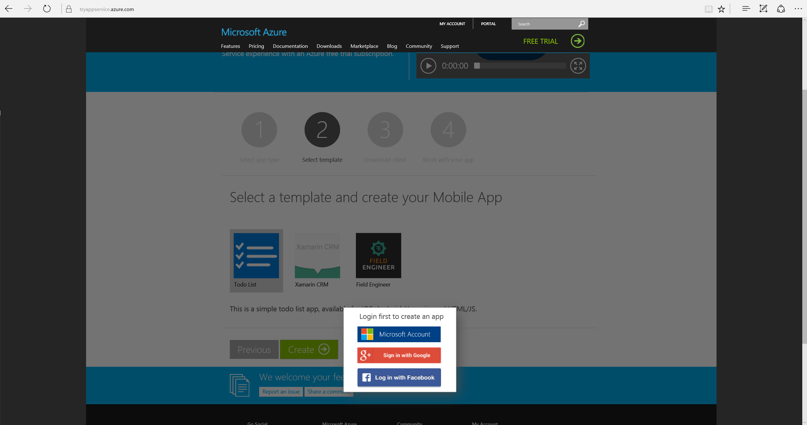
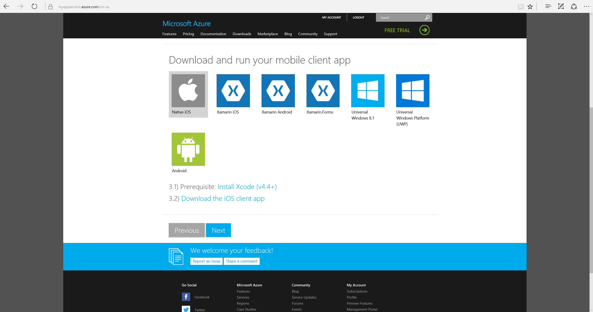
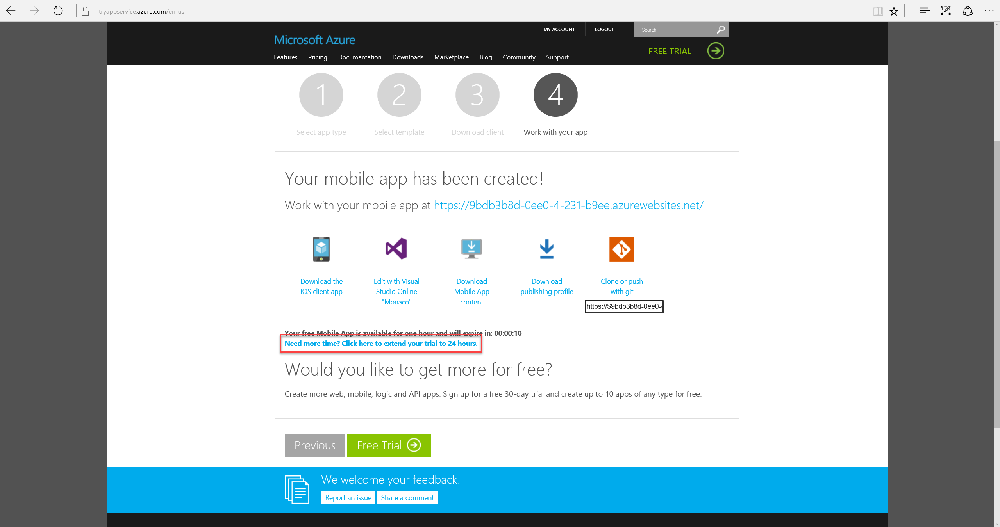
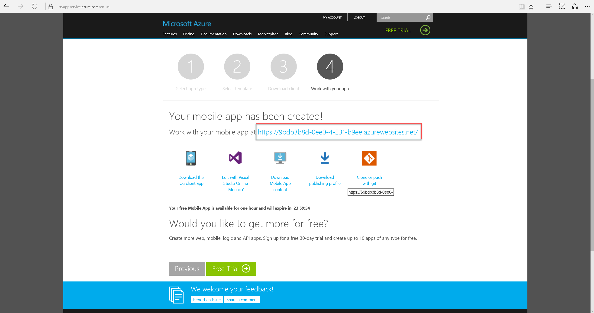
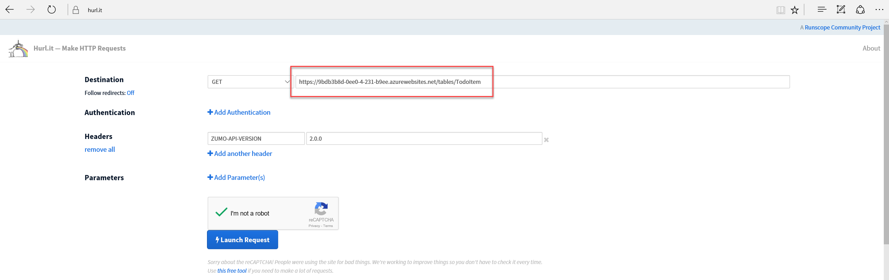
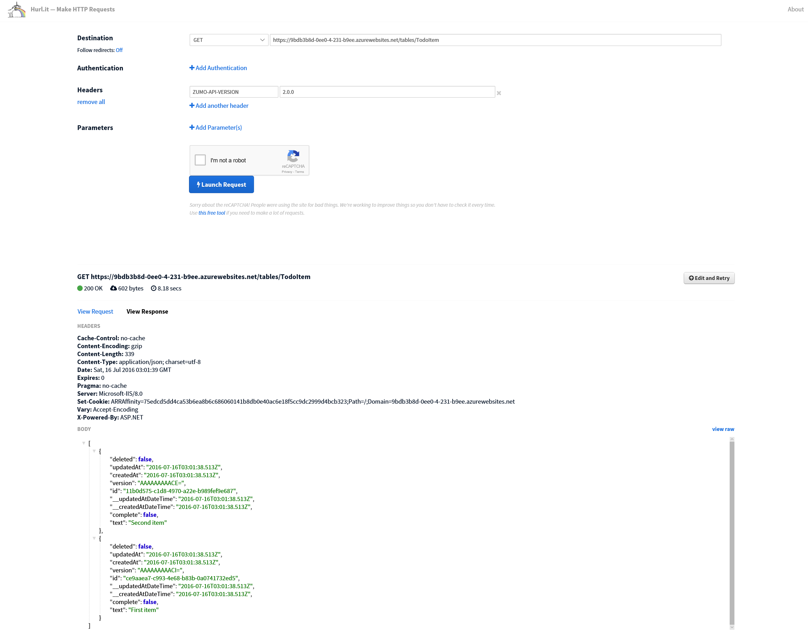

# Create an Azure Mobile Apps Instance

## Overview

In this step-by-step exercise, you will create a new **Mobile App** instance using Azure's *App Service*.

## Step-by-Step

- Navigate to <https://tryappservice.azure.com/>
- Select the **Mobile App** app type.
  
- Select the **Todo List** template and click the **Create** button.
  
- Sign-in using a social identity to validate that you are a real person.
  
- You will see a list of options to download template apps. You can safely skip this step.
  
- Make sure you click the hyperlink to extend your trial from one hour to twenty-four hours.
  
- Copy and store your mobile app's url.
  
  > **Example**: https://9bdb3b8d-0ee0-4-231-b9ee.azurewebsites.net/

- Use any HTTP tool to send a *GET* request.
  > Tools include, <http://hurl.it>, *Postman* and *Fiddler*.

- Send a *Get* request to the **tables/TodoItem** resource using your URL as the base Url and adding a single additional header with the key *ZUMO-API-VERSION* and a value of *2.0.0*.
  > **Example**: https://9bdb3b8d-0ee0-4-231-b9ee.azurewebsites.net/tables/TodoItem

  

## Result

  
