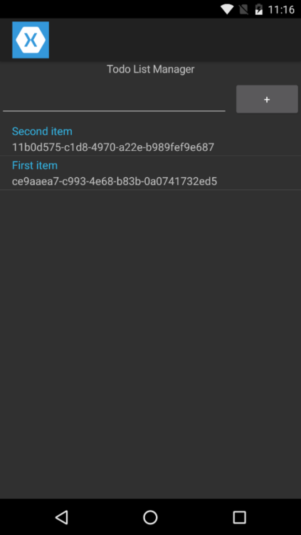

# **Solution:** Get Data from Azure Mobile Apps Using a HTTP Client



## Project Files

> **Note**: Don't forget to import the *Newtonsoft.Json* and *Microsoft.Net.Http* libraries from NuGet into the *PCL* project.

### Data/TodoHttpContext.cs

This implementation is pretty standard and simply uses HTTP requests for *GET* and *POST*. The Json.NET library handles encoding and decoding of JSON data.

```c#
using Newtonsoft.Json;
using System.Collections.Generic;
using System.Net.Http;
using System.Text;

namespace MobileBootcamp.Data
{
    public class TodoHttpContext : ITodoContext
    {
        private string _url = "https://9bdb3b8d-0ee0-4-231-b9ee.azurewebsites.net/tables/TodoItem";

        public void AddItem(TodoItem item)
        {
            HttpClient client = new HttpClient();
            client.DefaultRequestHeaders.Add("ZUMO-API-VERSION", "2.0.0");
            StringContent bodyContent = new StringContent(JsonConvert.SerializeObject(item), Encoding.UTF8, "application/json");
            var responseTask = client.PostAsync(this._url, bodyContent);
            responseTask.Wait();
            responseTask.Result.EnsureSuccessStatusCode();
        }

        public IEnumerable<TodoItem> GetItems()
        {
            HttpClient client = new HttpClient();
            client.DefaultRequestHeaders.Add("ZUMO-API-VERSION", "2.0.0");
            var responseTask = client.GetStringAsync(this._url);
            responseTask.Wait();
            string response = responseTask.Result;
            return JsonConvert.DeserializeObject<IEnumerable<TodoItem>>(response);
        }
    }
}

```

### HomeView.xaml.cs

We simply need to swap out the context implementation. The rest of our code can stay the same since we used an interface.

```c#
private ITodoContext _context = new TodoHttpContext();
```

## Visual Studio Solution

[You can always view the entire Visual Studio solution](solution/).
