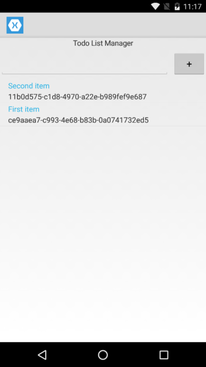

# **Solution:** Updating the Platform-Specific Look & Feel of Your Application



##

To accomplish this task, you need to open the *MainActivity.cs* file in your Android project and add a theme property (``Theme = "@android:style/Theme.Holo.Light"``) to the class decorator.

```c#
using Android.App;
using Android.Content.PM;
using Android.OS;

namespace MobileBootcamp.Droid
{
    [Activity(Label = "MobileBootcamp", Icon = "@drawable/icon", Theme = "@android:style/Theme.Holo.Light", MainLauncher = true, ConfigurationChanges = ConfigChanges.ScreenSize | ConfigChanges.Orientation)]
    public class MainActivity : global::Xamarin.Forms.Platform.Android.FormsApplicationActivity
    {
        protected override void OnCreate(Bundle bundle)
        {
            base.OnCreate(bundle);

            global::Xamarin.Forms.Forms.Init(this, bundle);
            LoadApplication(new App());
        }
    }
}
```

## Visual Studio Solution

[You can always view the entire Visual Studio solution](solution/).
